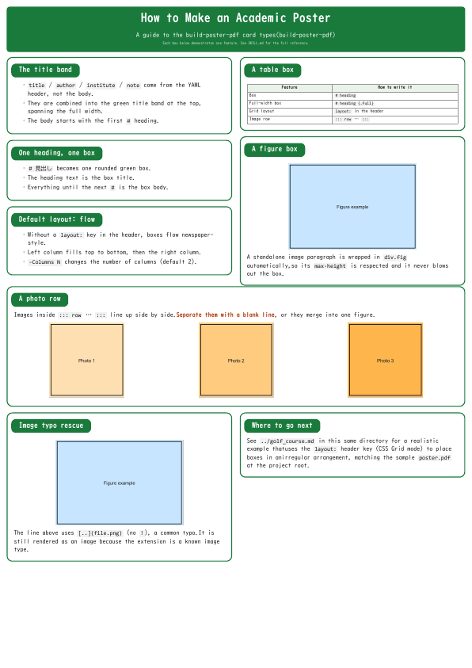
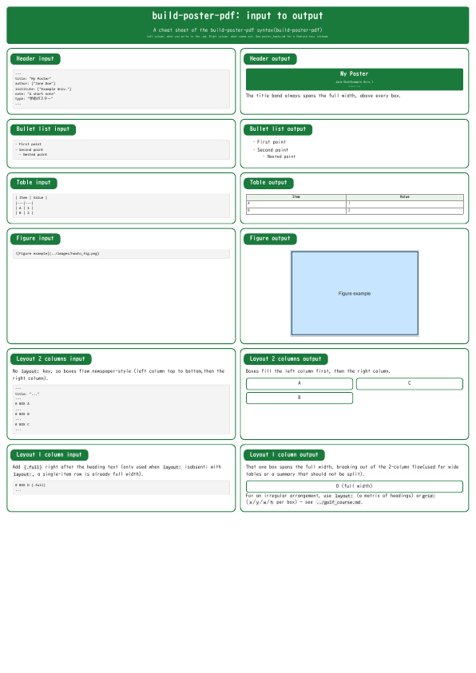
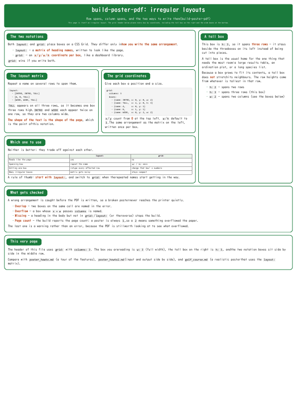
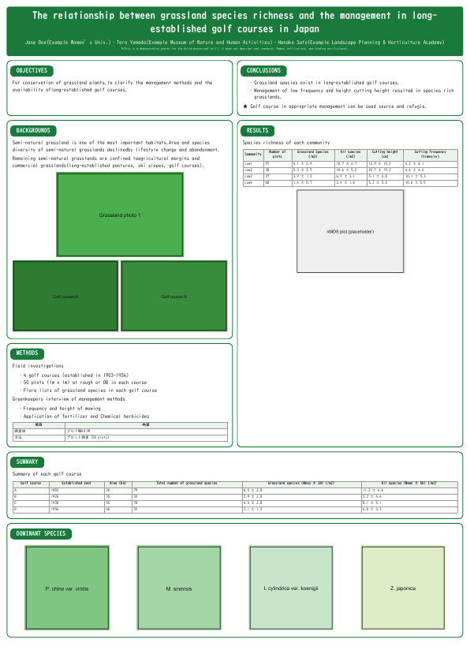

# acposter

md 原稿から学術ポスター (A0/A1・1枚) の PDF を作るツール，`build-poster-pdf` の
開発・検証プロジェクト．**LaTeX を使わず**，pandoc + ヘッドレス Chrome で組む．

ポスターを作るツールは3系統ある
([ggposter](https://github.com/matutosi/ggposter)・acposter・
[qtposter](https://github.com/matutosi/qtposter))．
**互いに置き換えるものではなく，案件ごとに選ぶ**．
README の項目と順序は3つで揃えてある．

## つくれるもの

- 用紙: A0 または A1 (縦・横)
- `# 見出し` ごとに1つの緑角丸枠 (箱)
- 既定は2段組みの新聞調の流し込み．ヘッダーに `layout:` (見た目どおりの行列) か
  `grid:` (各箱の `x`/`y`/`w`/`h` 座標) を書けば，CSS Grid で箱の配置
  (非対称な行またぎ・全幅なども) を明示できる
- 画像1枚・複数枚の横並び (`::: row`)，表，箇条書き
- 副題・ロゴ・差し色

## 前提

- **pandoc** (Markdown → HTML)
- **Chrome** (無ければ Edge/Chromium．HTML → PDF の印刷に使う)
- **pwsh** (PowerShell 7+)
- フォント **UD デジタル 教科書体 N** (Windows 10/11 に標準)．
  無いとき (Mac/Linux) は Hiragino → Noto → IPAGothic の順にフォールバックする

TeX Live も R も要らない．**Windows・Mac・Linux で動く**．

## 使い方

```powershell
pwsh -File .claude/skills/build-poster-pdf/make_poster_pdf.ps1 -Md <ファイル>.md
```

ヘッダーで用紙・向き・段数・書体などを決める．

```yaml
title: "半自然草原の植生と管理"
subtitle: "管理の頻度と種組成"   # 省略可
author: ["松村 俊和"]
institute: "所属機関名"
type: "学術ポスター"     # -Md を省いたときは，この型で対象の md を選ぶ
paper: "A0"              # 用紙 (A0 / A1)
orientation: portrait    # 向き (portrait / landscape)
columns: 2               # 段数
font: "Yu Gothic"
font-size: 26pt
note: "植生学会第30回大会"   # 表題帯の下端に小さく入る
logo: images/logo.png    # 省略可．表題帯の右に入る
accent: "#1a7a3c"        # 省略可．枠と表題帯の色 (既定は緑)
```

用紙・向き・段数・文字サイズ・書体・差し色は**引数でも書ける**
(`-Size`・`-Orientation`・`-Columns`・`-FontSize`・`-Font`・`-Accent`)．
**両方に書いたときは引数が勝ち，値が食い違えば警告が出る** (同じ値なら黙って通る)．
**副題 (`subtitle`)・ロゴ (`logo`)・型 (`type`) はヘッダーだけ**．いずれも省略できる．

組んだあとは**検算**する．刷ってから気づく事故を防ぐため，
ページ数 (ポスターは常に1)・用紙実寸・箱の数・埋め込みフォントを見る
(スクリプトの最後に自動で出る)．

中間の HTML を見たいときは `-KeepHtml` を付ける (`<基幹名>.tmp.html` が残る．
qtposter の `keep-typ: true` にあたる)．

引数と書き方の約束は
[`.claude/skills/build-poster-pdf/SKILL.md`](.claude/skills/build-poster-pdf/SKILL.md) が正．

## 書き方の約束

- **`# 見出し` が1つの箱**になる．見出しの文字がそのまま箱の表題．
  最初の `# ` より前は捨てられる (表題帯はヘッダーから作る)．
- **`# 見出し {.full}`** と書くと，段組みの途中でもその箱だけ全幅になる．
- 画像は ``．`!` の付け忘れは画像として救済する．
- 画像を横に並べたいときは `::: row` … `:::` で囲む (**画像どうしは空行で区切る**)．
- 表・箇条書き・コードブロックはふつうの Markdown．

## 配置の決め方

書かなければ**段組みの流し込み** (新聞調)．明示したいときは2通りある．

```yaml
layout:                        # 見た目どおりの行列
  - [OBJECTIVES, CONCLUSIONS]
  - [BACKGROUNDS, RESULTS]
```

```yaml
grid:                          # 箱ごとの座標 (0 起点，w/h の既定は 1)
  columns: 3
  boxes:
    - {name: OBJECTIVES, x: 0, y: 0, w: 2}
    - {name: RESULTS,    x: 2, y: 0, h: 3}
```

- 両方書くと `grid:` が優先され，警告が出る．
- 重なり・右へのはみ出し・本文の見出しとの食い違いは**名指しでエラーにして止める**．
- **`grid:` は3系統で完全に同じ書式**なので，配置ごと移し替えられる
  (`layout:` は ggposter と同名で構造が違うので移せない)．

## 見本

| | 見本 | 内容 |
|---|---|---|
| 1 | [`examples/poster_howto.md`](examples/poster_howto.md) | 機能の一巡り (箱・`layout:`・`{.full}`・`::: row`・画像救済) |
| 2 | [`examples/poster_howto2.md`](examples/poster_howto2.md) | 入力と出力の早見表．左列に入力の箱・右列に出力の箱を対にして並べる |
| 3 | [`examples/poster_howto3.md`](examples/poster_howto3.md) | 非対称な配置．`grid:` の座標指定と，`layout:` との書き分け |
| 4 | [`examples/golf_course.md`](examples/golf_course.md) | 実際のポスターに近い例 (架空のデータ)．`layout:` で非対称に置く |

```powershell
pwsh -File .claude/skills/build-poster-pdf/make_poster_pdf.ps1 -Md examples/<ファイル>
```

縮小した見本 (画像をクリックすると原稿の md へ)．

| 1. 機能の一巡り | 2. 入力と出力の早見表 |
|---|---|
| [](examples/poster_howto.md) | [](examples/poster_howto2.md) |

| 3. 非対称な配置 | 4. 実際のポスターに近い例 |
|---|---|
| [](examples/poster_howto3.md) | [](examples/golf_course.md) |

## 姉妹ツールとの行き来

**本文の書き方は統一できない** (構造化データと散文という根の違い)．
そのかわり**ヘッダーと配置は移し替えられる**．

| 意味 | 正 | 受ける別名 |
|---|---|---|
| 副題 | `subtitle` | (無し) |
| 著者 | `author` | `authors`・`poster-authors` |
| 所属 | `institute` | `institutes`・`affiliation`・`affiliations` |
| 注記 | `note` | `funding`・`footer` |
| 用紙 | `paper` | (無し．`-Size` と同義) |
| 段数 | `columns` | `cols` |
| 文字サイズ | `font-size` | `font_size` |
| 書体 | `font` | `font-family`・`font_family` |
| ロゴ | `logo` | `logos` |
| 差し色 | `accent` | (無し) |

**`size` はどのツールでも別名にしない**．ggposter では用紙，qtposter では文字サイズを
指すため．用紙は `paper`，文字は `font-size` と書き分ける．

3つの比較は `todo/.claude/notes/poster_tools.md`，細かい対応表は SKILL.md の
「姉妹ツールとの行き来」節にある．

## 構成

| ファイル・ディレクトリ | 中身 |
|---|---|
| `.claude/skills/build-poster-pdf/SKILL.md` | 使い方の正 (引数・ヘッダー・配置) |
| `.claude/skills/build-poster-pdf/make_poster_pdf.ps1` | 本体 (pandoc → Chrome → 検算) |
| `.claude/skills/build-poster-pdf/poster.css` | 体裁 (箱・表題帯・段組み・図) |
| `.claude/skills/build-poster-pdf/poster.lua` | 表題帯の組み立て，`# ` → 箱，`layout:`/`grid:` の Grid 化 |
| `.claude/skills/build-poster-pdf/poster_common.ps1` | ps1 の純関数 (ヘッダーの読み取り・設定の決定・`file://` URL) |
| `tests/run_lua_tests.ps1` | `poster.lua` の単体テスト (下記) |
| `tests/run_ps1_tests.ps1` | `poster_common.ps1` の単体テスト (下記) |
| `examples/` | 見本4本と，その PDF |
| `images/` | 見本が使う仮の画像 |
| `previews/` | README に載せる見本の縮小画像 (PDF から `pdftoppm -r 18` で作る) |
| `requirements/` | 5エージェントによる独立要件定義と，確定した方針 |

## テスト

```powershell
pwsh -File tests/run_lua_tests.ps1   # poster.lua       (42件)
pwsh -File tests/run_ps1_tests.ps1   # poster_common.ps1 (35件)
```

`run_lua_tests.ps1` は小さな md を pandoc に通し，出てきた HTML とエラー・警告の
文面を確かめる (42件)．**Chrome も画像も要らない**ので数秒で終わり，3つの OS で
同じに走る．見ているのは主に「ポスターが組めるか」ではなく
**「書き間違いを黙って通さないか」**．座標の書き損じ・見出し名の食い違い・
箱の重なり・`layout:` の非長方形などが，**PDF ができてしまう前にエラーで止まる**
ことを1件ずつ確かめている．

`run_ps1_tests.ps1` は ps1 側の純関数を確かめる (35件)．**pandoc も Chrome も
要らない**．ヘッダーの浅い読み取り (字下げのある入れ子を採らない)，引数と
ヘッダーの優先関係と食い違いの警告，どちらに書いても同じ検査が効くこと，
空白や `#` を含むパスの `file://` URL への逃がし方を見る．

見本4本のビルド (Chrome まで通す) は GitHub Actions が macOS と Ubuntu で回し，
できた PDF の中身を `pdftotext` で確かめて成果物として上げる．

## 現状と経緯

- **Windows・Mac・Linux で動く**．Mac/Linux は GitHub Actions
  (`.github/workflows/test.yml`) で実際にビルドし，PDF の中身まで確認している．
- **`build-poster-pdf` はこのリポジトリだけで版管理している**プロジェクト専用スキル．
  指示があるまでは，3台共有のユーザースキル (`~/.claude/skills/`) へは上げない．
- 要件定義は「5エージェントが独立に考えて比較する」進め方で行った．全文は
  [`requirements/agent_A.md`](requirements/agent_A.md) 〜
  [`requirements/agent_E.md`](requirements/agent_E.md)，
  決定は [`requirements/decision.md`](requirements/decision.md)．
- 詳しい進捗は [`.claude/CLAUDE.md`](.claude/CLAUDE.md)．

## ライセンス

**MIT** ([`LICENSE`](LICENSE))．
