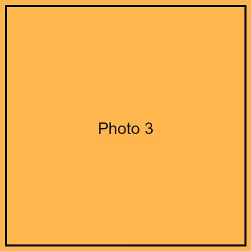

# The title band

- `title` / `author` / `institute` / `note` come from the YAML header, not the body.
- They are combined into the green title band at the top, spanning the full width.
- The body starts with the first `# ` heading.

# One heading, one box

- `# 見出し` becomes one rounded green box.
- The heading text is the box title.
- Everything until the next `# ` is the box body.

# Default layout: flow

- Without a `layout:` key in the header, boxes flow newspaper-style.
- Left column fills top to bottom, then the right column.
- `-Columns N` changes the number of columns (default 2).

# A table box

| Feature        | How to write it         |
| -------------- | ----------------------- |
| Box            | `# heading`             |
| Full-width box | `# heading {.full}`     |
| Grid layout    | `layout:` in the header |
| Image row      | `::: row` ... `:::`     |

# A figure box

A standalone image paragraph is wrapped in `div.fig` automatically,
so its `max-height` is respected and it never blows out the box.

# A photo row {.full}

Images inside `::: row` … `:::` line up side by side.
**Separate them with a blank line**, or they merge into one figure.

::: row

:::

# Image typo rescue

[この画像はリンク記法で書いている](../images/howto_fig.png)

The line above uses `[..](file.png)` (no `!`), a common typo.
It is still rendered as an image because the extension is a known image type.

# Where to go next

See `../golf_course.md` in this same directory for a realistic example that
uses the `layout:` header key (CSS Grid mode) to place boxes in an
irregular arrangement, matching the sample `poster.pdf` at the project root.
